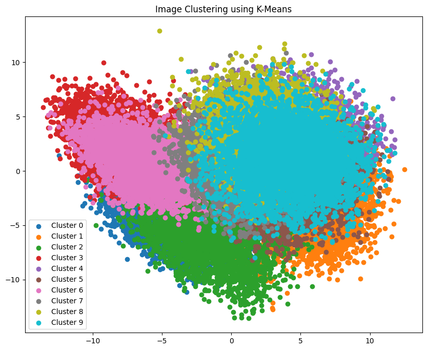

# Image Clustering with KMeans Clustering algorithm and ResNet18 feature extractor

## Overview
This is an educational repository on clustering images with K-Means Clustering and ResNet18 feature extraction The implementation is done primarily as an implementation exercise as well as utility.

## Table of Contents
- [Results](#results)
- [Installation](#installation)
- [Sorting](#usage)

## Results
Below is an example of clustering images from CIFAR10. As seen, number of clusters help determine effective separation.
<p align="center">
  
</p>

## Installation
1. Clone the repository:
    ```bash
    git clone https://github.com/CodeKnight314/image-clustering.git
    ```

2. Create and activate a virtual environment (optional but recommended):
    ```bash
    python -m venv cluster-env
    source cluster-env/bin/activate
    ```

3. cd to project directory: 
    ```bash 
    cd image-clustering/
    ```

4. Install the required packages:
    ```bash
    pip install -r requirements.txt
    ```

## Usage
To run the script, use the following command-line arguments:
```bash
    python main.py --image_dir <path_to_images> --n_clusters <number_of_clusters> --output_dir <output_directory> --in_place
```
**Arguments:**
- `--image_dir` Image directory containing all images within one folder without no subdirectories.
- `--n_clusters` Number of clusters to separate the images into.
- `--output_dir`: Optionally output directory for storing organized images, required if in_place is toggled.
- `--in_place`: Optional flag to determine either organizing inplace or by copying contents to separate directory.